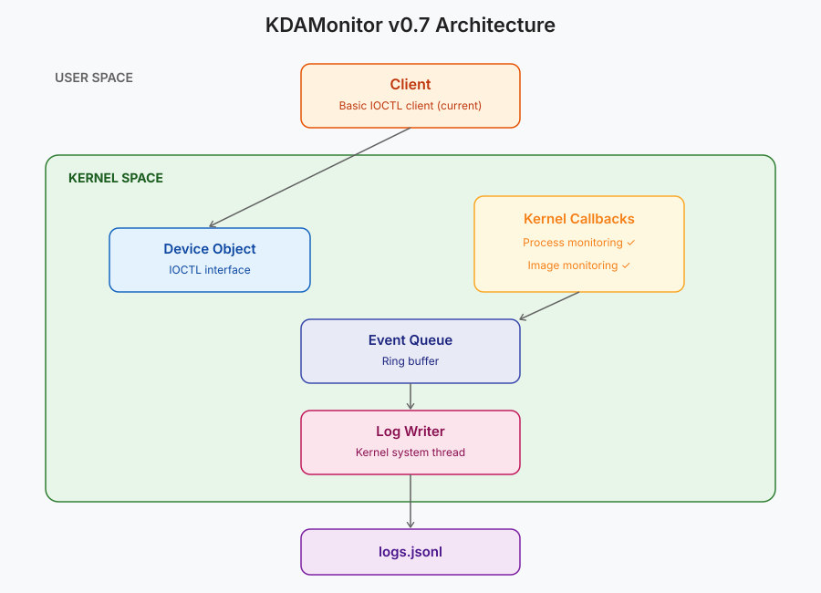

# KDAMonitor - Kernel Driver Activity Monitor

A Windows kernel driver (in C) for logging process, image load, network connection and registry activity in real time.

> ⚠️ Learning/research project: intended for isolated sandbox VMs only, do not use in production.
---

## Status

Early development: currently at **v0.5 (process sensor)**. First monitoring feature (process create/exit) implemented; four sensors remain planned. See [ROADMAP.md](./ROADMAP.md) for planned versions.

---

## Concept

KDAMonitor is made of two components:

- **`driver/`**: a Windows kernel driver (`.sys`) that runs at the kernel level, registering with native kernel callbacks (process, thread, image load, registry) and WFP (network) to observe system activity from a point malware cannot easily see or bypass.
- **`client/`** *(minimal test client for now; full real-time viewer planned for v0.11)*: a usermode command-line application that connects to the driver...

The intended use case is malware sandbox analysis: run a sample in an isolated VM with KDAMonitor loaded, and get a full timeline (through logs) of its process, network, and persistence activity after execution.

---

## Architecture (v0.5)



---

## Requirements

- Windows 10/11 (test VM recommended, test signing mode enabled)
- Windows Driver Kit (WDK)
- Visual Studio with WDK extension

---

## Project structure (v0.4)

```bash
KDAMonitor/
├── client
│   ├── include
│   │   └── client.h
│   ├── src
│   │   └── client.c
│   ├── client.vcxproj
│   └── client.vcxproj.filters
├── docs
│   ├── dumps
│   │   └── IRQL_NOT_LESS_OR_EQUAL.dmp
│   ├── crashes.md
│   └── kdamonitor_architecture.svg
├── driver
│   ├── include
│   │   ├── device.h
│   │   ├── driver.h
│   │   ├── event_queue.h
│   │   ├── event_types.h
│   │   ├── ioctl.h
│   │   ├── kdamon_config.h
│   │   ├── kdamon_shared.h
│   │   ├── log_writer.h
│   │   └── process_callback.h
│   ├── src
│   │   ├── device.c
│   │   ├── driver_entry.c
│   │   ├── event_queue.c
│   │   ├── ioctl.c
│   │   ├── log_writer.c
│   │   └── process_callback.c
│   ├── KDAMonitor.inf
│   ├── KDAMonitor.vcxproj
│   ├── KDAMonitor.vcxproj.filters
│   └── packages.config
├── .gitignore
├── CHANGELOG.md
├── KDAMonitor.sln
├── LICENSE
├── README.md
└── ROADMAP.md
```

---

## Building

### Build

Open `KDAMonitor.sln` in Visual Studio with the WDK extension installed, and build the `KDAMonitor` project (Debug or Release, x64). The compiled driver (`KDAMonitor.sys`) is output to `x64\<Configuration>\KDAMonitor.sys` at the solution root.

### Test signing

The driver is not signed by a trusted CA, so the target VM must have test signing enabled:

```bash
bcdedit /set testsigning on
```

Reboot for this to take effect.

### Loading the driver

From an elevated command prompt on the test VM:

```bash
mkdir C:\Drivers
copy <path-to>\KDAMonitor.sys C:\Drivers
sc create KDAMonitor type= kernel binPath= C:\Drivers\KDAMonitor.sys
sc start KDAMonitor
```

The driver creates `C:\KDAMonitor\logs\` on its own if missing, and writes one timestamped `.jsonl` log file per session there.

### Unloading the driver

```bash
sc stop KDAMonitor
sc delete KDAMonitor
```

### Notes

- Kernel debug output (`KdPrint`) requires [DebugView](https://learn.microsoft.com/en-us/sysinternals/downloads/debugview) running as Administrator with **Capture Kernel** enabled, and the debug print filter set:


```bash
reg add "HKLM\SYSTEM\CurrentControlSet\Control\Session Manager\Debug Print Filter" /v DEFAULT /t REG_DWORD /d 0xFFFFFFFF /f
```
Reboot after setting this.

---

## Resources

### Official documentation
- [Windows Driver Kit documentation](https://learn.microsoft.com/en-us/windows-hardware/drivers/)
- [Getting Started with Windows Drivers](https://learn.microsoft.com/en-us/windows-hardware/drivers/gettingstarted/)
- [Kernel-Mode Driver APIs reference](https://learn.microsoft.com/en-us/windows-hardware/drivers/ddi/)
- [Windows Filtering Platform documentation](https://learn.microsoft.com/en-us/windows/win32/fwp/windows-filtering-platform-start-page)
- [Debugging Tools for Windows / WinDbg](https://learn.microsoft.com/en-us/windows-hardware/drivers/debugger/)

### Code samples
- [microsoft/Windows-driver-samples](https://github.com/microsoft/Windows-driver-samples)

### Books
- *Windows Kernel Programming*, Pavel Yosifovich (2nd edition)
- *Windows Internals*, Yosifovich / Solomon / Ionescu (7th edition) — used as a reference, not read cover to cover

---

## License

This project is licensed under the MIT License - see the [LICENSE](LICENSE) file for details.